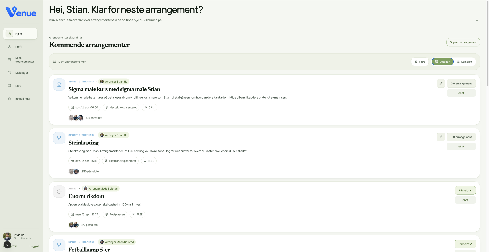
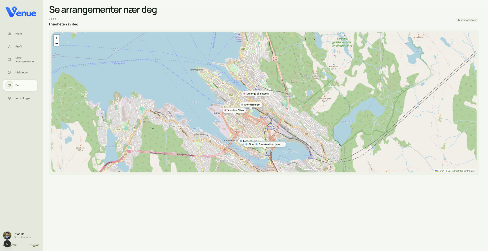
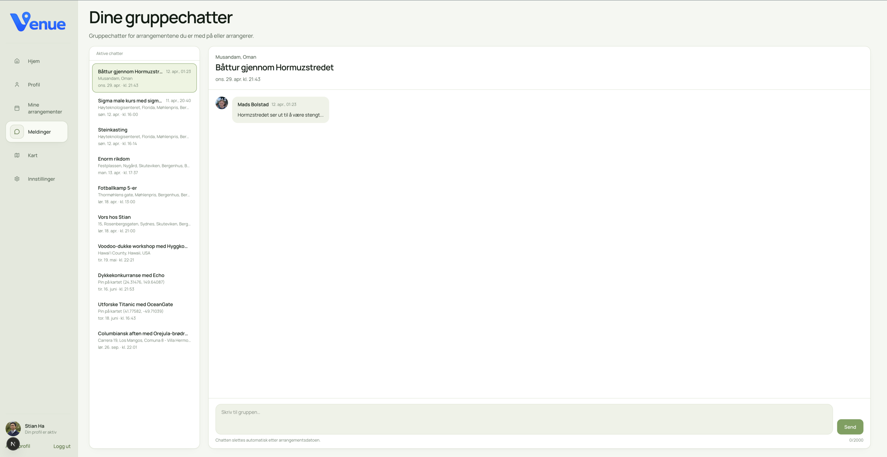

# Venue
> De Fede

---

### Medlemmer

| Navn |
|------|
| Håvard Hallerud |
| Jonas Justesen |
| Mads Bolstad |
| Stian Ha |

---

## Beskrivelse

Venue er en plattform for å opprette og delta på offentlige arrangementer. Hvem som helst kan starte hva som helst, og delta på alt. Man kan filtrere arrangementer etter type og sted, og det vil være noe å finne for alle. Melder man seg opp til et arrangement blir man automatisk med i en gruppechat for det arrangementet, men dette er ikke enda et sosialt medie! Venue handler hovedsakelig om å få folk opp av sofaen, av mobilen, og ut for å møte nye mennesker.

Arrangementer kan bli funnet på to måter. Enten ved bruk av aktivitetsstrømmen, som er det første som møter deg ved oppstart, eller på kartet som du finner på sidebaren på venstresiden av skjermen. I aktivitetsstrømmen kan du filtere på kategori og tidspunkt, samt søke etter beskrivende ord. Velger du heller å bruke kartet, så får du opp et kart over nærområdet/byen din med arrangementer plassert som pins der de vil finne sted.

I tillegg til info om arrangementet skal du kunne se litt grunnleggende informasjon om hosten og de andre deltakerne. Her er det en liten biografi hvor brukere kan skrive litt om seg selv, og en liste over interesser du kan huke av på ettersom hva som passer deg.

---

## Kjøre

### 1. Clone the repository

```bash
git clone 
cd 
```

### 2. Install dependencies

```bash
npm install
```

### 3. Set up environment variables

Create a `.env.local` file in the root of the project:

```bash
NEXT_PUBLIC_SUPABASE_URL=https://vobkkoreuupxnvnaycax.supabase.co
NEXT_PUBLIC_SUPABASE_ANON_KEY=sb_publishable_dQ9l8feRf_VYQTZuUjW8Ig_wx3bAZxn
```

### 4. Run the development server

```bash
npm run dev
```

Open [http://localhost:3000](http://localhost:3000) in your browser.

---

### Bilder


