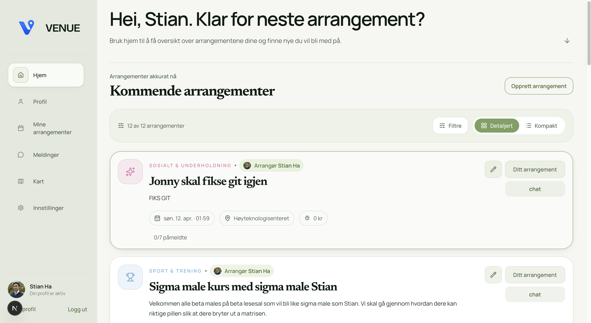

# Venue
> De Fede

---

### Medlemmer

| Navn |
|------|
| Håvard Hallerud |
| Jonas Justesen |
| Mads Bolstad |
| Stian Ha |

---

## Beskrivelse

En nettside hvor man kan se og melde seg opp til offentlige arrangementer. Man kan filtrere arrangementer etter type og sted. Melder man seg opp til et arrangement blir man automatisk med i en gruppechat(?) for det arrangementet. ...

Venue er et sted der man kan finne og melde seg opp til ulike arrangementer. Disse kan filteres etter type og sted slik at man kan finne arrangementer som passer akkurat deg.

---

## Kjøre

### 1. Clone the repository

```bash
git clone 
cd 
```

### 2. Install dependencies

```bash
npm install
```

### 3. Set up environment variables

Create a `.env.local` file in the root of the project:

```bash
NEXT_PUBLIC_SUPABASE_URL=https://vobkkoreuupxnvnaycax.supabase.co
NEXT_PUBLIC_SUPABASE_ANON_KEY=sb_publishable_dQ9l8feRf_VYQTZuUjW8Ig_wx3bAZxn
```

### 4. Run the development server

```bash
npm run dev
```

Open [http://localhost:3000](http://localhost:3000) in your browser.

---

### Bilder

